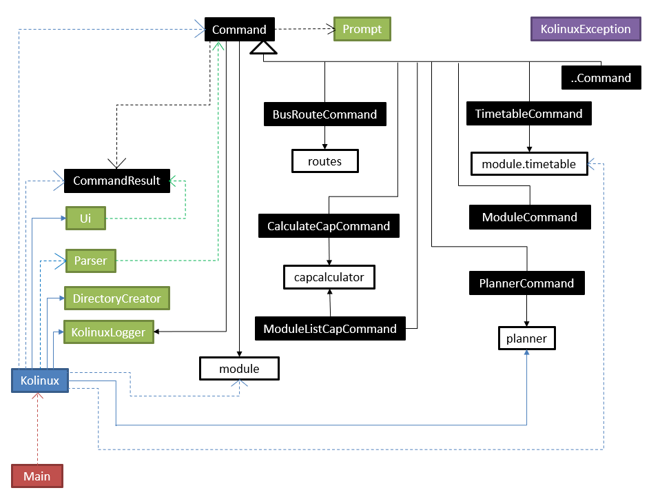
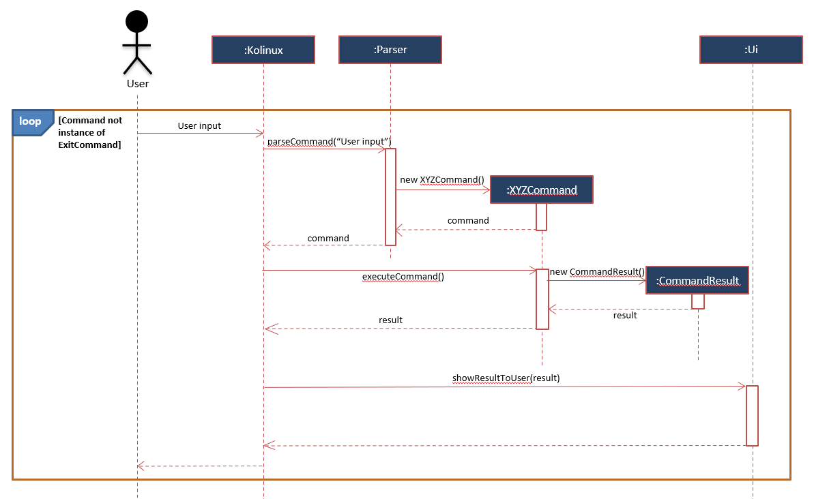
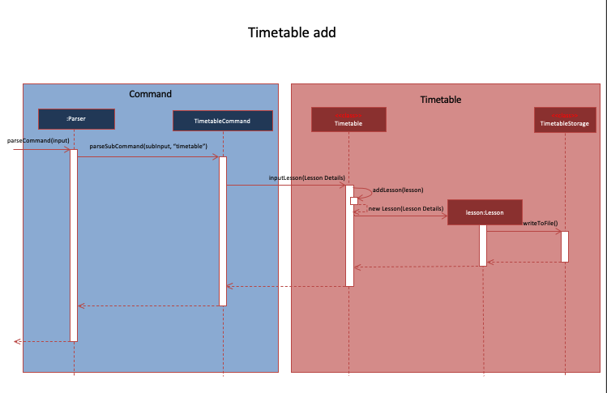
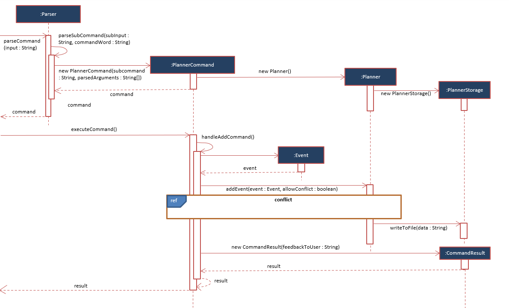
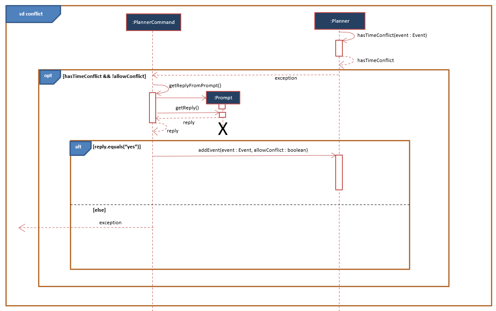
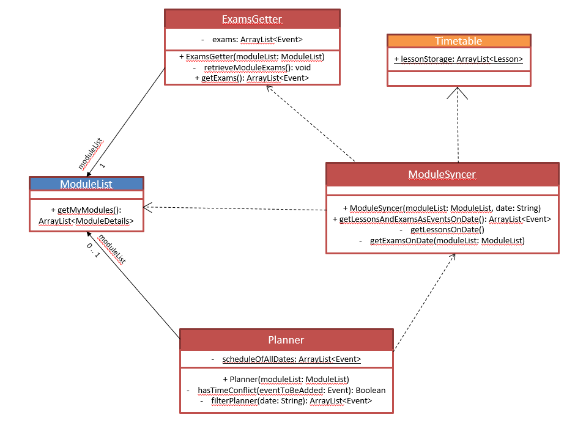
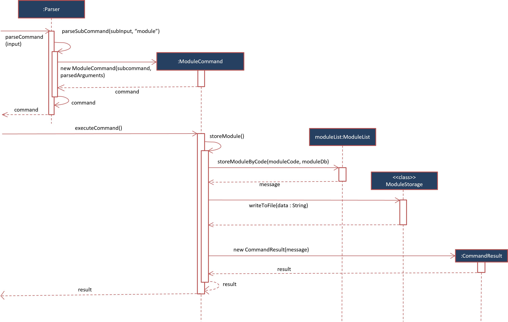
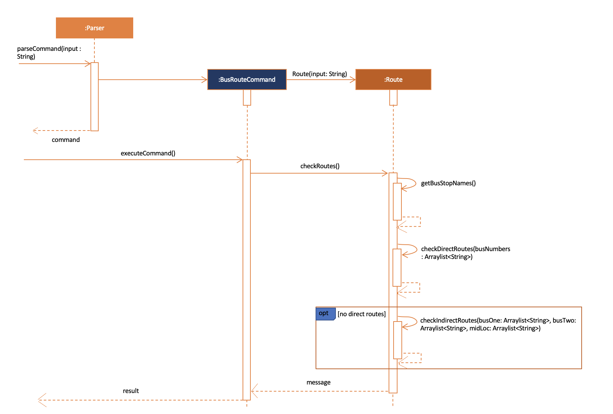

# Developer Guide
* [Acknowledgements](#acknowledgements)
* [Design](#design)
* [Implementation](#implementation)
  * [`timetable add`](#add-to-timetable-feature)
  * [`planner add`](#add-to-planner-feature)
  * [`module store/delete`](#store/delete-a-module-by-module-code)
  * [`cap code`](#cap-calculator-by-code-feature)
  * [`bus`](#bus-routes-feature)
* [Product Scope](#product-scope)
  * [Target user profile](#target-user-profile)
  * [Value proposition](#value-proposition)
* [User Stories](#user-stories)
* [Non-Functional Requirements](#non-functional-requirements)
* [Glossary](#glossary)
* [Instructions for manual testing](#instructions-for-manual-testing)
## Acknowledgements

* User Guide and Developer Guide of [AddressBook Level-3](https://se-education.org/addressbook-level3/)
* [NUSMods API](https://api.nusmods.com/v2/) 
* [GSON](https://github.com/google/gson)

## Design

### Main Components of the Architecture

The `Main` class is responsible for initializing the main components upon start-up of the application, and 
deciding the execution path of the application through the main components based on reading the user inputs.

The application consists of the following main components responsible for the high-level execution of a user input:
1. `Kolinux`: Initializes the components in the correct sequence, and connects them up with each other.
2. `util.Ui`: User interface of the application.
3. `util.Parser`: Makes sense from the user input and decides which `Command` class to initialize.
4. `util.DirectoryCreator`: Ensures the `/data` directory is created and present for data storage.
5. `util.KolinuxLogger`: Logs the user activity into `data/logger.log`.
6. `commands`: Collection of user commands that determines execution.
7. `routes`: Collection of classes used by Route Finder feature.
8. `module`: Collection of classes used by Module Manager feature.
9. `module.timetable`: Sub-collection of classes used by Timetable feature.
10. `planner`: Collection of classes used by Planner feature.
11. `capcalculator`: Collection of classes used by CAP Calculator feature.

The architecture diagram below shows a high-level overview of how components interact with each other. 

❕ _Note: Interactions between collections of classes are not shown for simplicity. Visit the 
[Implementation](#implementation) section for more detailed representations of such interactions._



The sequence diagram below shows a high-level overview of the interaction between entities during the execution
of a user input _(XYZCommand represents any class that inherits from Command)_.



## Implementation

This section describes some noteworthy details on how some features are implemented along with more detailed
representations of the interactions between components.

### Add to timetable feature

The timetable add mechanism is facilitated by `Timetable` where the format of the input is as such: 
`timetable add MODULE_CODE/LESSON_TYPE/DAY/START_TIME/END_TIME`. The lessons added to `Timetable` 
via inputLesson(String[] lessonDetails) is stored in the `lessonStorage` within the program via 
the method `addLesson(Lesson lesson)` and locally in `TimetableStorage` which saves it 
to `timetable.txt` file to constantly save the lessons' data. It implements the following operations:

* Timetable#inputLesson(String[] lessonDetail) containing Timetable#addLesson(Lesson lesson) - Adds the lesson 
to `timetableStorage` based on the type of lesson it is, which is included in the lessonDetail.
* TimetableStorage#writeToFile() - Saves the lesson details to `timetable.txt` locally.

#### ❕ Notes about the methods:

* String[] lessonDetails consists of MODULE_CODE, LESSON_TYPE (`TUT` - tutorial, `LEC` - lecture or `LAB` - lab), 
DAY, START_TIME, END_TIME. 
* Lesson class is inherited by Tutorial, Lecture and Lab to add lessons based on the LESSON_TYPE as shown 
in the example below.

Given below are the examples of the usage of `timetable add` of lessons to the timetable.

Example 1: Adding a tutorial to the `lessonStorage` ( lesson of type `TUT` )


Example 2: Adding a lecture to the `lessonStorage` ( lesson of type `LEC` )


Example 3: Adding a lab to the `lessonStorage` ( lesson of type `LAB` )


The following sequence diagram shows the `timetable add` operation:




### Add to Planner feature

The Add to Planner mechanism is facilitated by `Planner`. Before adding an event, the `Event` is first checked for any
time conflicts with existing events/lessons/exams. Events are only added if there are no time conflicts or the 
user authorised the addition of a conflicted `Event`. Events added to the `Planner` are stored in a list 
`scheduleOfAllDates` which contains all added `Event` by the user. The events added are also written to the internal 
storage `data/planner.txt` which saves the user data locally. 

The feature is implemented by `Planner#addEvent(Event event, boolean allowConflict)` which invokes the following
methods:
* `Planner#hasTimeConflict(Event event)` which checks for any time conflicts between `event` and any existing events
in `scheduleOfAllDates`, lessons, and exams.
* `PlannerStorage#writeFile(String data)` which appends the data of the new `Event` to `data/planner.txt` for local
storage.

The figure below represents the sequence diagram when `planner add` is entered by the user:





The `Planner#hasTimeConflict(Event event)` method is integrated with `Timetable` and `ModuleList` so that lessons and
exams may be fetched in addition to `scheduleOfAllDates` for the `event` to check time conflicts against. The
integration in the method is mainly done via the `Planner#filterPlanner(String date)` call. The code snippet below
shows how `Planner#hasTimeConflict(Event event)` invokes `Planner#filterPlanner(String date)`. The return value
`filteredPlanner` will contain all the existing events/lessons/exams occurring on the date of the `event` that 
is to be added.

```
    private boolean hasTimeConflict(Event eventToBeAdded) {
        ArrayList<Event> filteredPlanner = filterPlanner(eventToBeAdded.getDate());
        String startTime = eventToBeAdded.getStartTime();
        String endTime = eventToBeAdded.getEndTime();
        for (Event event : filteredPlanner) {
            if (!(startTime.compareTo(event.getEndTime()) >= 0 || endTime.compareTo(event.getStartTime()) <= 0)) {
                return true;
            }
        }
        return false;
    }
```

The main working mechanism of `Planner#filterPlanner(String date)` is as follows:
1. Construct a `ModuleSyncer` object with the `date` specified. The object will populate a list of events consisting
of the lessons and exams occurring on `date` using the data fetched from `Timetable` and `ModuleList`.
2. Get the list from `ModuleSyncer`, and add the events in `scheduleOfAllDates` that are occurring on `date` via 
a `Stream`.
3. Return the list.

The list returned will then be used by `event` to check for any time conflicts.

The class diagram below shows the associations between `Planner`, `ModuleSyncer`, `Timetable`, `ModuleList`, and 
`ExamsGetter`.



### Store/delete a module by module code

The `ModuleCommand` class extends the `Command` class and handles all module related commands. In the context of storage and deletion, operations are performed of a list of `ModuleDetails` encapsulated in an instance of  `ModuleList` (`moduleList`). The `ModuleList` class implements the following methods to achieve this:

- `ModuleList#storeModuleByCode(String code, ModuleDb moduleDb)`
- `ModuleList#deleteModuleByCode(String code)`

❕ Notes about the methods:

`moduleDb` is an instance of `ModuleDb` that contains a hashmap, relating each module's code (key) to its respective `ModuleDetails` (value). For storing a module, a `ModuleDetails` instance corresponding to a module code is appended to list in `moduleList`

The input format for storage and deletion of modules is as follows:

- Storage: `module store MODULE_CODE`

- Deletion: `module delete MODULE_CODE`

  

Given below are examples of the usage of `module store/delete` and how the store/delete system behaves at each step.

Step 1: The user launches the application. `myModules` , the list of `ModuleDetails` instances, is initialized with the latest saved modules from local storage. If no modules are stored, the resulting list will be empty.

Example: `myModules` is initialized with single `ModuleDetails` instance corresponding to `CS2113T`


Step 2: The user executes `module store CS2101` command to store information regarding `CS2101` in a new instance of `ModuleDetails` and append it to `myModules`. The `module store` prefix ensures `ModuleList#storeModuleByCode(String code, ModuleDb moduleDb)` is called. 


Step 3: The user executes `module delete CS2101` command to delete the instance of `ModuleDetais` corresponding to `CS2101` from `myModules`. The `module delete` prefix ensures `ModuleList#deleteModuleByCode(String code)` is called. 


The following sequence diagram models how the `module store` operation works:



The `module delete` operation follows a similar sequence. Instead of calling the ModuleCommand#storeModule() method, the ModuleCommand#deleteModule() method is invoked. internally, this calls the `deleteModuleByCode` method from `moduleList`. All other steps remain the same. 


### cap calculator by code feature

This cap calculation is managed using `CapCalculatorByCode`. It extends `CapCalculator` which stores
the input modules and grades from user as a `CalculatorModuleList` in `modules`, which is a subclass 
of `ModuleList` dedicated for cap calculation. 

When the command `cap code` is given by the user, the constructor is called to retrieve and store the modules 
from the input. After the object construction is done, `CapCalculator#executeCapCalculator()` method is then 
invoked for the cap calculation. 

In order to achieve these functionalities, the following methods 
from `CapCalculatorByCode` are invoked.

* `CapCalculatorByCode#getInputModules(String input)` — which retrieves the module codes and grades from String input
and store them as `CalculatorModuleList`
* `CapCalculatorByCode#getCap()` — which is the methods used to do all the cap calculation.

In addition, the following methods implemented in `CapCalculator` are also invoked to ensure an error-free
functionality.

* `CapCalculator#executeCommand()` — which is an overridden method from `Command` is used to facilitate cap calculation
and exception handling methods.
* `CapCalculator#checkModulesNotEmpty()` — which ensures that the module list of the object is not empty.
* `CapCalculator#checkInvalidModules()` — which checks if there are any invalid modules after the cap calculation.

Below is the sequence diagrams showing important steps of how `cap code` operates:


### bus routes feature
The bus routes feature is facilitated by the `BusRouteCommand` class. The `BusRouteCommand` class extends the `Command` class. 
When the user invokes and uses the bus routes feature the `BusRouteCommand` constructor creates a `Route` class object and passes
the `input` string to the `Route` class. The operation is implemented in the following way.

* The overriden function `executeCommand()` calls the `Route#checkRoutes()` method. 
* The `Route#checkRoutes()` contains the `Route#getBusStopNumber()`, `Route#checkDirectRoutes(ArrayList<String> busNumbers)` and `Route#checkIndirectRoutes(ArrayList<String> busOne, ArrayList<String> busTwo, ArrayList<String> midLoc)` - Checks whether there is a direct or an indirect route between the 2 user given bus stops and returns a string depending on the result.
* `Route#getBusStopNumber()` - Converts the user given bus stop names to bus stop numbers which can then be used to find if the bus stops are connected.
* `Route#checkDirectRoutes(ArrayList<String> busNumbers)` - Check whether there is a direct bus route between the 2 user given bus stops by calling the `Graph#isConnected(int u, int v)` method which uses BFS to check if any 2 points in the directed unweighted graph are connected.
* `Route#checkIndirectRoutes(ArrayList<String> busOne, ArrayList<String> busTwo, ArrayList<String> midLoc)` - Checks whether there is an alternate route between the 2 user given bus stops which requires a single change of bus at an intermediate bus stop.

The following sequence diagram explains the bus routes feature.



## Product scope
### Target user profile:

* needs help with adapting to university life by understanding the grading system, university bus routes etc.
* has a need to manage their schedule along with the modules they are taking in the semester
* can type fast
* prefers typing to mouse interactions
* is reasonably comfortable using CLI apps

### Value proposition:

Users can manage all important university related tasks (Module Manager, Event Planner, Timetable, Bus Route Finder, 
and CAP calculator) in a single integrated platform.

## User Stories

| Version 	| As a ...                     	| I want to ...                                                                                                   	| So that ...                                                	|
|---------	|------------------------------	|-----------------------------------------------------------------------------------------------------------------	|------------------------------------------------------------	|
| v1.0    	| As a NUS freshman            	| be able to view all my modules in one local platform                                                            	| I can save time                                            	|
| v1.0    	| As a NUS freshman            	| view the schedule that I created for myself everyday                                                            	| I will not miss out on any important tasks for the day     	|
| v1.0    	| As a NUS freshman            	| add events to my schedule conveniently and ahead of time                                                        	| I will not forget about them when the day comes            	|
| v1.0    	| As a NUS freshman            	| find which buses I could take to go from one location to another in campus                                      	| I do not get lost within campus                            	|
| v1.0    	| As a NUS student             	| to view my timetable for the modules I'm taking in the current semester                                         	| I know what are my commitments of the week are like        	|
| v1.0    	| As a NUS student             	| add modules that I am interested in taking to my module list                                                    	| I can start preparing for modreg ahead of time             	|
| v1.0    	| As a NUS student             	| remove modules that I am no longer interested in taking from my list                                            	| I can focus on the modules which I'm interested in         	|
| v2.0    	| As a user                    	| see my plan of the day in a chronological order                                                                 	| I will not miss out any important events                   	|
| v2.0    	| As an overwhelmed freshman   	| be able to delete events from my Planner because of my unpredictable schedule                                   	| I can remove cancelled events out of my list.                 |
| v2.0    	| As a user                    	| see a list of my modules                                                                                        	| I can plan my academic journey                             	|
| v2.0    	| As a user                    	| be able to add events even when it conflicts with another event                                                 	| I can train my multitasking skills and be more productive. 	|
| v2.0    	| As a user                    	| view my classes when using the Planner for more effective planning of events                                    	| I can plan my schedule very precisely                      	|
| v2.0    	| As a user                    	| to modify my timetable                                                                                          	| I can swap classes after several rounds of modreg          	|
| v2.0    	| As a user                    	| to add the lessons to the timetable based on the modules, in the module list, I'm about to take in the semester 	| I only need to choose the day and start time of lesson     	|
| v2.0    	| As a user                    	| my module related data must be automatically saved                                                              	| I can be access it at a later time                         	|
| v2.0    	| As a user                    	| continue my module planning where I left off                                                                    	| I can refine my plan over time                             	|
| v2.0    	| As a user                    	| store grades for each of my module                                                                              	| I can check my CAP                                         	|

## Non-Functional Requirements

{Give non-functional requirements}
<ol>
<li> Should work on any mainstream OS as long as it has Java 11 or above installed. </li>
<li> A user with above average typing speed for regular English text (i.e. not code, not system admin commands) 
should be able to accomplish most of the tasks faster using commands than using the mouse.</li>
<li> Should be able to execute every command from the user within one second. </li>
</ol>

## Glossary

* *Mainstream OS*: Windows, Linux, Unix, OS-X
* *Event*: Personal event added to the Planner by the user
* *Lesson*: Class (Lecture, Tutorial, or Lab) for a particular module added to the Timetable by the user
* *Exam*: Official final examination for a particular module

## Instructions for manual testing

### Storing a module by module code

1. Storing a new module with a valid code

   - Test case: `module store CS2113T`

     Expected:  Initially the module list is empty. One module is added and a success message is printed to standard output.

2. Storing a module with an invalid code (non-existent module)

   - Test case: `module store invalid_module`

     Expected:  There is no module in the database with a code `invalid_module`. An error message is shown, prompting the user to enter a valid module's code.

3. Storing a pre-existing module in the list

   - Test case: `module store CS2113T`

     Expected:  The module list already contains `CS2113T`. Upon encountering a module with a duplicate code, an error message is shown, prompting the user to enter a new module's code.

     

4. 

   

### Adding an event to Planner

1. Adding an event with no time conflicts with any existing events, lessons, or exams to the Planner.
   

   * Test case: `planner add watch movie/2021-10-20/1800/2100`
   
      Expected: Event is added to the list. Success message printed as output.


   * Test case: `planner add project meeting/20211020/0700/0800`
     
      Expected: Event is not added to the list. Error message regarding date and time format printed as output.


   * Test case: `planner add go back in time/2021-10-20/1400/1300`
   
      Expected: Event is not added to the list. Error message regarding wrong time order printed as output.


   * Other incorrect commands to try: `planner add something wrong//`, `planner add something amazing/ 3pm to 4pm`
     
      Expected: Similar to previous cases where an error message regarding the format of command is printed as output.

2. Adding an event with time conflicts with at least one existing event, lesson, or exam to the Planner.


  * Prerequisites: Add the event by `planner add conflict test/2022-05-05/0800/1100`. Add the module
    `module store cs2113t` and add a lesson `timetable add cs2113t/lec/thursday/1600/1800`.
    _Do note 2021-05-05 is a Thursday._


  * Test case: `planner list 2022-05-05`

     Expected: The event `conflict test`, lesson `CS2113T LEC`, exam `CS2113T Exam` are displayed as output.


  * Test case: `planner add love conflicts/2022-05-05/xxxx/yyyy` where `xxxx` and `yyyy` are start times and end
    times respectively which overlaps with any of the events listed.
   
       Expected: Event is not added to the list. A message will be shown seeking permission to proceed with the
       operation. Entering `y` will lead to a success message, while anything else will lead to the operation cancelled.

