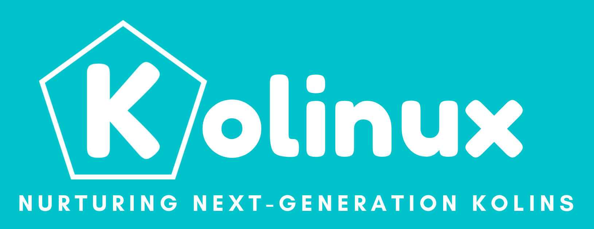

# Kolinux

Kolinux is built to help NUS Computer Engineering freshmen to better integrate into university life
by allowing them to manage their work and learn more about NUS, all in 1 platform. It is optimized
for CLI users so that they can access the information that they require faster by typing in commands.

Useful links:
* :book: [User Guide](UserGuide.md)
* :bulb: [Developer Guide](DeveloperGuide.md)
* :family_man_boy_boy: [About Us](AboutUs.md)
