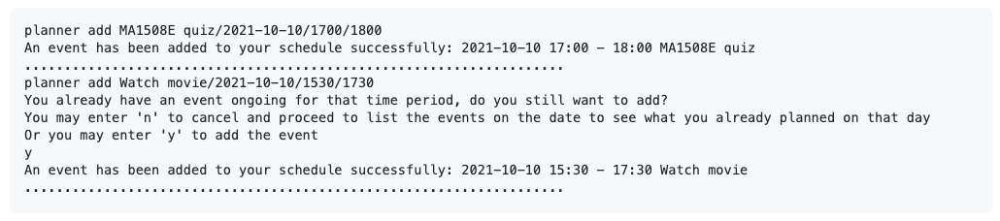

# Welcome to Kolinux User Guide! 😃

## Introduction

_Kolinux_ helps NUS freshmen to better integrate into university life by allowing them to 
**manage their modules and schedule**, **familiarise with the NUS internal bus system**, and **receive grade
suggestions based on their CAP** all in a **single integrated platform**. It is optimized for CLI 
users so that they can access the information that they require faster by typing in commands easily.

Hence, _Kolinux_ offers a wide range of features for freshmen. These features include a **module manager**
for freshmen to manage their modules and view information about them, a **timetable** to view their classes, an 
**event planner** for freshmen to organise their schedule for the day, a **CAP calculator**, and a **route finder** 
for the NUS internal shuttle bus.

This user guide brings you on a tour around _Kolinux_ and gives you step-by-step instructions on using its features.
Alternatively, you may visit the [Table of Contents](#table-of-contents) to go back to the table of contents! for quick access to any of the features. You
may also navigate to the [List of Commands](#2-list-of-commands) to view a summary of all our available commands and
their usages.

The following explains the use of different icons in this user guide:
* ⚠️ - Notes about the feature.
* ❗ - Important rules that you should follow when using the program.
* 🔗 - Links to related sections in this user guide.

### Latest Releases

* 💥 [`v2.1`](https://github.com/AY2122S1-CS2113T-W11-1/tp/releases/tag/v2.1) Released on Nov 8, 2021.
* 💥 [`v2.0`](https://github.com/AY2122S1-CS2113T-W11-1/tp/releases/tag/v2.0) Released on Oct 26, 2021.
* 💥 [`v1.0`](https://github.com/AY2122S1-CS2113T-W11-1/tp/releases/tag/v1.0) Released on Oct 12, 2021.

## Table of Contents

* 1 [Quick Start](#1-quick-start)
* 2 [List of Commands](#2-list-of-commands)
* 3 [Features](#3-features)
  * 3.1 [`module`](#31-module-manager-module)
    * 3.1.1 [`module add`](#311-add-modules-to-module-list-by-code-module-add)
    * 3.1.2 [`module delete`](#312-delete-modules-from-module-list-by-code-module-delete)
    * 3.1.3 [`module list`](#313-list-modules-from-module-list-module-list)
    * 3.1.4 [`module view`](#314-view-module-details-module-view)
    * 3.1.5 [`module grade`](#315-set-a-modules-grade-in-module-list-module-grade)
    * 3.1.6 [`module cap`](#316-calculate-overall-cap-from-modules-in-module-list-module-cap)
  * 3.2 [`timetable`](#32-timetable-timetable)
    * 3.2.1 [`timetable add`](#321-add-lessons-to-timetable--timetable-add)
    * 3.2.2 [`timetable delete`](#322-delete-lessons-from-timetable--timetable-delete)
    * 3.2.3 [`timetable view`](#323-view-timetable-on-cli--timetable-view)
    * 3.2.4 [`timetable update`](#324-update-a-lesson-to-another-timing-your-timetable--timetable-update)
    * 3.2.5 [`timetable list`](#325-list-the-lessons-and-their-timings-on-a-specific-day-timetable-list)
  * 3.3 [`planner`](#33-event-planner-planner)
    * 3.3.1 [`planner add`](#331-add-an-event-to-planner-planner-add)
    * 3.3.2 [`planner list`](#332-list-events-on-a-specific-date-planner-list)
    * 3.3.3 [`planner delete`](#333-delete-an-event-from-planner-planner-delete)
  * 3.4 [`bus`](#34-nus-bus-route-finder-bus)
    * 3.4.1 [`bus`](#341-bus-route-search-bus)
    * 3.4.2 [`bus stop list`](#342-list-of-all-bus-stop-names-bus-stop-list)
  * 3.5 [`cap`](#35-cap-calculator-cap)
    * 3.5.1 [`cap mc`](#351-calculate-cap-using-modular-credit-cap-mc)
    * 3.5.2 [`cap code`](#352-calculate-cap-using-module-code-cap-code)
  * 3.6 [`help`](#36-view-menu-help)
  * 3.7 [`bye`](#37-exit-bye)
* 4 [Limitations](#4-current-limitations)
* 5 [FAQ](#5-faq)
* 6 [Data Storage](#6-data-storage)
* 7 [Contact Us](#7-contact-us)

## 1. Quick Start

### Installation and start-up

1. Ensure that you have Java 11 or above installed.
2. Download the latest version of `Kolinux.jar` from [here](https://github.com/AY2122S1-CS2113T-W11-1/tp/releases).
3. Copy `Kolinux.jar` to an empty folder.
4. Start the command prompt.
5. Navigate to the folder `Kolinux.jar` is stored on the command prompt.
6. Launch `Kolinux.jar` using `java -jar Kolinux.jar`.
7. Enter commands to use _Kolinux_.

The following is what you should expect to observe on the terminal upon start-up:
```
java -jar Kolinux.jar


(_)   | |    | |(_)
 _____| |___ | | _ ____  _   _ _   _
|  _   _) _ \| || |  _ \| | | ( \ / )
| |  \ \ |_| | || | | | | |_| |) X (
|_|   \_)___/ \_)_|_| |_|____/(_/ \_)
Welcome to Kolinux! Enter "help" to view the list of commands
....................................................................
```

## 2. List of Commands 


>⚠️Note: Words in uppercase are parameters that you should supply to the program.

## 3. Features 

_Kolinux_ provides a **single integrated platform** consisting of **5 core features**:

1. `module` - Module Manager
2. `timetable` - Timetable
3. `planner` - Event Planner
4. `bus` - Route Finder
5. `cap` - CAP Calculator

### 3.1 Module Manager: `module`

The module manager allows you to [`add`](#311-add-modules-to-module-list-by-code-module-add), 
[`delete`](#312-delete-modules-from-module-list-by-code-module-delete), and 
[`list`](#313-list-modules-from-module-list-module-list) the modules you are taking for the semester. You 
are also able to [`view`](#314-view-module-details-module-view) important information regarding a module, such as the 
description and workload requirements. In addition, you are able to set a 
[`grade`](#315-set-a-modules-grade-in-module-list-module-grade) on the modules in your list for the purpose of 
[`cap`](#316-calculate-overall-cap-from-modules-in-module-list-module-cap) calculation and grades suggestion.

#### 3.1.1 Add modules to module list by code: `module add`

**Format:** `module add MODULE_CODE `

- `MODULE_CODE` is not case-sensitive, hence `cs2113t` and `CS2113T` will give the same output.

**Example of usage:**

- `module add CS2113T`

This is what you should observe on the terminal after successfully storing a module:

```
Successfully added module: CS2113T
....................................................................
```

#### 3.1.2 Delete modules from module list by code: `module delete`

**Format:** `module delete MODULE_CODE `

- `MODULE_CODE` is not case-sensitive, hence `cs2113t` and `CS2113T` will give the same output.

**Example of usage:**

- `module delete CS2113T`

This is what you should observe on the terminal after successfully deleting a module:

```
Successfully deleted module: CS2113T
....................................................................
```
>⚠️ Note: When you delete a module from module list, all the data relating to this module will be deleted from 
> timetable as well

#### 3.1.3 List modules from module list: `module list`

**Format:** `module list `

**Example of usage:**

- `module list` when CS2113T is already stored in the list

This is what you should observe on the terminal when you list your modules:

```
CS2113T Software Engineering & Object-Oriented Programming

Workload:
Lecture: 2.0 hours
Tutorial: 1.0 hours
Project Work: 3.0 hours
Preparation: 4.0 hours
....................................................................
Remember to add the module's lessons to the timetable based on the workload
....................................................................
```

#### 3.1.4 View module details: `module view`

**Format:** `module view MODULE_CODE`

- `MODULE_CODE` is not case-sensitive, hence `cs2113t` and `CS2113T` will give the same output.

**Example of usage:**

* `module view CS1010`

This is what you should observe on the terminal when you view the information of a module:

```
module view CS1010
CS1010: Programming Methodology
Department: Computer Science
Faculty: Computing
Credits: 4
Grade: N/A
This module introduces the fundamental concepts of
problem solving by computing and programming using
an imperative programming language. It is the first
and foremost introductory course to computing.  Topics
covered include computational thinking and computational
problem solving, designing and specifying an algorithm,
basic problem formulation and problem solving approaches,
program development, coding, testing and debugging,
fundamental programming constructs (variables, types,
expressions, assignments, functions, control structures,
etc.), fundamental data structures (arrays, strings,
composite data types), basic sorting, and recursion.
....................................................................
```

#### 3.1.5 Set a module's grade in module list: `module grade`

**Format:** `module grade CODE/GRADE `

- `MODULE_CODE` is not case-sensitive, hence `cs2113t` and `CS2113T` will give the same output.
- `GRADE` is not case-sensitive, hence `a+` and `A+` will be treated as the same grade.

**Example of usage:**

- `module grade CS2113T/A` when CS2113T is already stored in the list

This is what you should observe on the terminal when you set the grade of a module in your module list:

```
module grade CS2113T/A
CS2113T grade set to A
....................................................................
```

You can also enter `reset` or simply `0` in place of your grade to reset the module's grade.

**Example of usage:**

- `module grade CS2113T/reset` when CS2113T has its grade stored in the list

This is what you should observe on the terminal when you reset the grade of a module in your module list:

```
module grade CS2113T/reset
CS2113T grade reset
....................................................................
```

>⚠️ Note: For grades with plus (+) or minus (-) suffix, it is crucial to ensure that there is no empty space between 
the grade letter and the suffix. E.g. `A+` instead of `A +`

>🔗 The grades set using this command will be used to calculate CAP based on your module list. 
You may choose to enter real grades to calculate your current CAP and/or enter target grades to calculate a CAP goal.
Visit [`module cap`](#316-calculate-overall-cap-from-modules-in-module-list-module-cap) to find out more!

#### 3.1.6 Calculate overall CAP from modules in module list: `module cap`

**Format:** `module cap`

**Example of usage:**

- `module cap` when at least one module is already stored in the list with the module's grade

This is what you should observe on the terminal when you calculate the CAP based on your module list:

```
module cap
Based on your available grade, your overall CAP is 5.00
....................................................................
```

This feature can also be used to show you the minimum grade to get for the other modules in order to achieve your 
desired CAP by including the CAP at the end of the command.

**Format:** `module cap DESIRED_CAP`

**Example of usage:**
- `module cap 4.0` when at least one module does not have the grade stored

This is what you should observe on the terminal when you try to get grade suggestion based on a desired CAP:

```
module cap 4.0
Based on your modules, you have to get an average grade of B+ or higher 
in order to achieve your desired CAP
....................................................................
```

>🔗 Click [here](#table-of-contents) to go back to the table of contents!

### 3.2 Timetable: `timetable`

This feature allows you to [`add`](#321-add-lessons-to-timetable--timetable-add) and 
[`delete`](#322-delete-lessons-from-timetable--timetable-delete) lessons from your timetable based on the modules 
added in the module manager. 
You are also able to [`update`](#324-update-a-lesson-to-another-timing-your-timetable--timetable-update)
your existing lessons to another time slot.
It also provides you an aesthetic visual representation of your timetable for you to 
[`view`](#323-view-timetable-on-cli--timetable-view) on the CLI.
If you prefer only to see the lessons that are taking place for the day without the empty slots, you can make use of 
[`list`](#325-list-the-lessons-and-their-timings-on-a-specific-day-timetable-list) to view the lesson details for 
that day.

#### 3.2.1 Add lessons to timetable : `timetable add`

**Format:** `timetable add MODULE_CODE/LESSON_TYPE/DAY/START_TIME/END_TIME`

* Ensure `MODULE_CODE` is stored in the module list using 
[`module add`](#311-add-modules-to-module-list-by-code-module-add) first before adding to timetable
* `LESSON_TYPE` needs to be one of the following: 
  * `TUT` refers to tutorial
  * `LEC` refers to lecture
  * `LAB` refers to lab
  * `SEC` refers to sectional
  * `REC` refers to recitation
* `START_TIME` and `END_TIME` needs to follow the following format: `hhMM` and must be between the school hours 
`0600` and `2100`
* `DAY` must be from between `Monday` and `Friday`
* `MODULE_CODE`,`LESSON_TYPE` and `DAY`  are not case-sensitive
  * i.e. `CS1010` is the same as `cs1010`
  * i.e. `TUT` is the same as `tut` or `Tut`
  * i.e. `monday` is the same as `MONDAY`


**Example of usage:**

* `timetable add CS1010/TUT/Monday/1200/1300`
* `timetable add CS2113T/LEC/friday/1600/1800`

This is what you should observe on your terminal when adding a lesson to the timetable:
```
timetable add CS1010/TUT/Monday/1200/1300
Lesson has been added to timetable
....................................................................
```
>⚠️ Note: Ensure `MODULE_CODE` is stored in the module list using
[`module add`](#311-add-modules-to-module-list-by-code-module-add) first before adding to timetable as only
the modules added to module list can be added to the timetable

>⚠️ ️Note: Please also note that the timetable has been built to take lesson of durations in multiples of 30 mins.
> This has been done to ensure readability of the timetable on CLI when you input
> [`timetable view`](#323-view-timetable-on-cli--timetable-view). So you will not be allowed to enter 15 min 
> slots of lessons onto the timetable like e.g. 1315 or 1245.

>⚠️ Note: Due to a few inaccuracies in the prescribed workload hours in NUSMods, you can now add lessons which exceed 
> the workload hours, but you will be given a warning and asked to confirm if you would like to carry out with adding 
> the lesson as shown in the example below:
> ```
> Input hours for CS1010 TUT exceeds the total workload
> It exceeds 1.0 hours
> Do you want to continue adding the lesson despite
> exceeding the workload? Please enter y or n
> ```

>⚠️ Note: NUSMods api stores the prescribed workload in a 5-tuple of numbers, 
> describing the estimated number of hours per week the student is expected to put in for the module for 
> lectures, tutorials, laboratory, projects/fieldwork, and preparatory work respectively. 
> For example, a workload of [2, 1, 1, 3, 3] means the student should spend every week:
> * 2 hours in lectures
> * 1 hour in tutorials 
> * 1 hour at the lab
> * 3 hours doing project work
> * 3 hours preparing for classes
>
> Due to this limitation, for lesson types `SEC` (usually replaces `LEC` for certain modules) and `REC`, 
> users have to ensure the lesson hours are accurate before adding the lesson.

>🔗 Visit [`module`](#31-module-manager-module) for more information on the command formats.

#### 3.2.2 Delete lessons from timetable : `timetable delete`

**Format:** `timetable delete MODULE_CODE/LESSON_TYPE/DAY/START_TIME`

* Ensure `MODULE_CODE` is stored in the module list using
  [`module add`](#311-add-modules-to-module-list-by-code-module-add) first before adding to timetable
* `LESSON_TYPE` needs to be one of the following:
  * `TUT` refers to tutorial
  * `LEC` refers to lecture
  * `LAB` refers to lab
  * `SEC` refers to sectional
  * `REC` refers to recitation
* `DAY` must be from between `Monday` and `Friday`
* `MODULE_CODE`,`LESSON_TYPE` and `DAY`  are not case-sensitive
  * i.e. `CS1010` is the same as `cs1010`
  * i.e. `TUT` is the same as `tut` or `Tut`
  * i.e. `monday` is the same as `MONDAY`

**Example of usage:**

* `timetable delete cs1010/lec/tuesday/1200`
* `timetable delete CS2113T/LEC/Friday/1800`

This is what you should observe on your terminal when deleting a lesson from the timetable:
```
timetable delete cs1010/lec/tuesday/1800
CS1010 LEC 1800 tuesday has been deleted from timetable
....................................................................
```

#### 3.2.3 View timetable on CLI : `timetable view`

**Format:** `timetable view`

**Example of usage:**

* `timetable add CS1010/LEC/monday/1900/2000` followed by `timetable view`

This is what you should observe on your terminal when you want to view the timetable:


>⚠️ Note: Please expand your CLI to view the timetable clearly if the timetable appears skewed.

>⚠️ Note: Extraneous parameters after `view` will be ignored

#### 3.2.4 Update a lesson to another timing your timetable : `timetable update`

**Format:** `timetable update MODULE_CODE/LESSON_TYPE/OLD_DAY/OLD_START_TIME/NEW_DAY/NEW_START_TIME`

* `LESSON_TYPE` needs to be one of the following:
  * `TUT` refers to tutorial
  * `LEC` refers to lecture
  * `LAB` refers to lab
  * `SEC` refers to sectional
  * `REC` refers to recitation
* `START_TIME` and `END_TIME` needs to follow the following format: `hhMM` and must be between the school hours
  `0600` and `2100`
* `DAY` must be from between `Monday` and `Friday`
* `MODULE_CODE`,`LESSON_TYPE` and `DAY`  are not case-sensitive
  * i.e. `CS1010` is the same as `cs1010`
  * i.e. `TUT` is the same as `tut` or `Tut`
  * i.e. `monday` is the same as `MONDAY`

**Example of usage:**

* `timetable update cs1010/lec/tuesday/1100/monday/1200`
* `timetable update CS2113T/LEC/Friday/1300/Monday/1300`

This is what you should observe on your terminal when you update a lesson on the timetable:
```
timetable update cs1010/lec/tuesday/1300/monday/1200
CS1010 LEC has been updated
....................................................................
```

#### 3.2.5 List the lessons and their timings on a specific day: `timetable list`

**Format:** `timetable list DAY`

* `DAY` must be from between `Monday` and `Friday`

**Example of usage:**

* `timetable list monday`
* `timetable list friday`

This is what you should observe on your terminal when you list out the lessons for a specific day based on your 
timetable

```
timetable list monday
You have no lessons on monday

Your lessons for monday has been listed above
....................................................................
timetable list friday
0700 - 0800 CS1010 TUT 
1600 - 1700 CS1101S TUT 
1900 - 2000 CS1010 LEC 

Your lessons for friday has been listed above
....................................................................
```

>🔗 Click [here](#table-of-contents) to go back to the table of contents!

### 3.3 Event Planner: `planner`

The event planner works by allowing you to [`add`](#331-add-an-event-to-planner-planner-add), 
[`delete`](#333-delete-an-event-from-planner-planner-delete), and 
[`list`](#332-list-events-on-a-specific-date-planner-list) any events happening on a specific date. 
This is for you to manage your schedules daily. This feature is also integrated with the timetable and the module 
manager so that you will also be able to view your lessons and exams on specific dates.

#### 3.3.1 Add an event to Planner: `planner add`

**Format:** `planner add DESCRIPTION/DATE/START_TIME/END_TIME`

* The `DATE` needs to follow the following format: `yyyy-mm-dd`
* `START_TIME` and `END_TIME` needs to follow the following format: `hhMM`

**Example of usage:**

* `planner add MA1508E quiz/2021-10-10/1700/1800`

This is what you should observe on your terminal when adding an event to your planner:




>⚠️ Note: If you attempt to add an event that has a time conflict with another event/lesson/exam, you will need to 
give additional confirmation if you wish to proceed.

#### 3.3.2 List events on a specific date: `planner list`

**Format:** `planner list DATE`

* The `DATE` needs to follow the following format: `yyyy-mm-dd`
* Adding extraneous parameters separated by `/` will be ignored. For example: `planner list 2021-10-10/something` will be treated the same as `planner list 2021-10-10`.

**Example of usage:**

* `planner list 2021-10-10`

This is what you should observe on the terminal when you list the events in your planner on a specific date:

```
planner list 2021-10-10
2021-10-10 SUNDAY
15:30 - 17:30 Watch movie
17:00 - 18:00 MA1508E quiz
....................................................................
```

>⚠️ Note: The `list` will include all the events, lessons, and exams occurring on the `DATE` specified.

>🔗 Visit the section on [`timetable`](#32-timetable-timetable) for commands to add lessons.

>🔗 Exams are added to the list automatically as modules are stored in the [`module`](#31-module-manager-module) manager.

#### 3.3.3 Delete an event from Planner: `planner delete`

**Format:** `planner delete DATE`

This command has two steps:
1. Input the command as shown in the format above.
2. Find the ID of the event you wish to delete from the schedule of events on `DATE` displayed.
3. Input the ID to delete the event.

* The `DATE` needs to follow the following format: `yyyy-mm-dd`
* Adding extraneous parameters separated by `/` will be ignored. For example: `planner delete 2021-10-10/something` will be treated the same as `planner delete 2021-10-10`.

**Example of usage:**

* `planner delete 2021-12-31` will prompt you to delete an event on `2021-12-31`.

This is what you should observe on the terminal when you delete an event on a specific date:


>⚠️ Note: Only events added via the `planner` will be displayed on the list in step 2.
Hence, you are not allowed to delete lessons added via the `timetable` and exams from the `planner`.

>🔗 Visit the section on [`timetable`](#32-timetable-timetable) for commands to delete lessons.

>🔗 Exams will be automatically deleted as modules are deleted from the [`module`](#31-module-manager-module) manager.

>🔗 Click [here](#table-of-contents) to go back to the table of contents!

### 3.4 NUS Bus Route Finder: `bus`

The route finder helps you find if there are [`bus`](#341-bus-route-search-bus) routes between any two NUS shuttle 
service bus stops. You will be recommended buses you can take to reach your destination. 
You also have the ability to view the [`bus stop list`](#342-list-of-all-bus-stop-names-bus-stop-list) which contains 
all the bus stop names which are covered by the NUS shuttle bus service. 
This feature allows you to get familiarised with the NUS internal shuttle bus route.

#### 3.4.1 Bus route search: `bus`

**Format:** `bus /START_LOCATION /END_LOCATION`

* Bus stop names are not case-sensitive

**Example of usage:**

* `bus /pgp /museum`

This is what you should observe on the terminal when finding a bus route between 2 bus stops:

```
Bus [D2] goes from PGP to MUSEUM
....................................................................
```

>🔗 The naming convention of `START_LOCATION` and `END_LOCATION` should follow [`bus stop list`](#342-list-of-all-bus-stop-names-bus-stop-list).

#### 3.4.2 List of all bus stop names: `bus stop list`

**Format:** `bus stop list`

**Example of usage:**

* `bus stop list`

This is what you should observe on the terminal when you list all the bus stop names in NUS:


>⚠️ Note: Routes implemented cover Buses A1, A2, D1, D2, E and K. Also routes are recommended if there is direct route or an indirect route
where the user needs to change and board another bus (only single change routes are recommended).

>🔗 Click [here](#table-of-contents) to go back to the table of contents!

### 3.5 CAP Calculator: `cap`

The CAP calculator helps you to keep track on your CAP and set desired grades for your modules. 
You can choose between different formats of module 
([`cap mc`](#351-calculate-cap-using-modular-credit-cap-mc) or [`cap code`](#352-calculate-cap-using-module-code-cap-code)) 
and the respective grade to allow more command flexibility.

>🔗 Visit [`module cap`](#316-calculate-overall-cap-from-modules-in-module-list-module-cap) to see how this feature can
be used with the module manager.

#### 3.5.1 Calculate CAP using modular credit: `cap mc`

**Format:** `cap mc MC/GRADE`

- `GRADE` is not case-sensitive, hence `a+` and `A+` will be treated as the same grade. 

**Example of usage:**

* `cap mc 4/A 6/B+ 4/B 4/B- 4/A+`

This is what you should observe on the terminal when you calculate CAP using MCs and grades:

```
cap mc 4/A 6/B+ 4/B 4/B- 4/A+
Your overall CAP will be 4.09 if you get your desired grades!
....................................................................
```

>⚠️ Note: For grades with plus (+) or minus (-) suffix, it is crucial to ensure that there is no empty space between
the grade letter and the suffix. E.g. `A+` instead of `A +`

#### 3.5.2 Calculate CAP using module code: `cap code`

**Format:** `cap code CODE/GRADE`

- `CODE` is not case-sensitive, hence `cs2113t` and `CS2113T` will give the same output.
- `GRADE` is not case-sensitive, hence `a+` and `A+` will be treated as the same grade.

**Example of usage:**

* `cap code CS2113T/A CS2101/C CG2027/B-`

This is what you should observe on the terminal when you calculate CAP using module code and grades:

```
cap code CS2113T/A CS2101/C CG2027/B-
Your overall CAP will be 3.40 if you get your desired grades!
....................................................................
```

>⚠️ Note: For grades with plus (+) or minus (-) suffix, it is crucial to ensure that there is no empty space between
the grade letter and the suffix. E.g. `A+` instead of `A +`

>🔗 Click [here](#table-of-contents) to go back to the table of contents!

### 3.6 View menu: `help`

Views the different commands available.

This is what you should observe on the terminal when you send a help command:


>🔗 Click [here](#table-of-contents) to go back to the table of contents!

### 3.7 Exit: `bye`

Terminates _Kolinux_.

This is what you should observe on the terminal upon termination:

```
bye
Bye! Thank you for using Kolinux
....................................................................
```

>🔗 Click [here](#table-of-contents) to go back to the table of contents!


## 4. Current limitations 

### NUSMods API

1. Due to the limitations in the project where our application is expected to perform without the use of internet, we 
are not able to get live updates from the api, and we have to work off the latest json file with relevant module 
details.
2. We did not extract the data for different timings for each lesson in a specific module as they are separated into 
individual json files for each module in the NUSMods api, as we wanted to be space efficient and stay within the 
memory space limits set we did not proceed with extracting this information. Also given that our product is expected 
to function without internet connection, we couldn't implement making a http request to NUSMods api based on user input 
to retrieve these timings. Which is why the timings of lessons are not yet available as it's out of the current 
project's scope.


## 5. FAQ

**Q**: How do I transfer my data to another computer? 

**A**: Locate the `/data` directory stored in the same folder as `Kolinux.jar`. Copy the directory to the other 
computer, in the same folder as `Kolinux.jar`. The data will be automatically read upon starting up `Kolinux`.

**Q**: Can I add recurring events to the `planner`?

**A**: Our current version doesn't support this functionality as we wanted to expand push forward the wide 
range of features before expanding each feature more in depth. For now, you would have to add the events to the 
specified dates individually

**Q**: Can I add 2 lessons to the same time slot in the `timetable`?

**A**: Our current version doesn't support this as we want to keep our timetable as concise as possible ensuring the 
readability of it on the CLI, thus what you might want to consider doing is to add the lessons directly to the `planner`
as the `planner` allows for conflicting events

## 6. Data Storage

_Kolinux_ automatically creates a directory `/data` upon the first start up. The directory consists of the files:

`logger.log` - User activity log of the most recent session.

`moduleList.txt` - Your module manager data.

`planner.txt` - Your planner data.

`timetable.txt` - Your timetable data.

>❗ You are strongly advised not to modify these files as it can corrupt important user data and cause data loss.

## 7. Contact Us

Our team welcomes you to contact us when faced with issues that this user guide fails to cover. We are
also open to any suggestions that you may have to improve _Kolinux_. 😃

You may find our contact information [here](AboutUs.md).

>🔗 Click [here](#table-of-contents) to go back to the table of contents!
